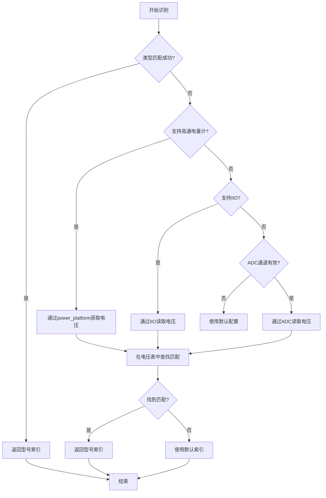

# 华为电池核心之battery_model模块
如果你做过 Android / Linux 设备，大概率见过这些现象：
- 手机明明还有 20%，突然几分钟掉到 5%
- 低温环境下电量掉得特别快
- 充到 99% 卡半天，或者 99% ↔ 100% 来回跳

**问题不是 UI 写错了，而是：**
**真实世界的电池，本来就不“听话”。**

> battery_model 是一个“把真实电池变得看起来很乖”的软件模型。

硬件给我们的，其实是一些很不友好的原始数据：
- 电压（会随负载剧烈变化）
- 温度（慢半拍，还不线性）
- 剩余容量（会抖）

如果你直接把这些数据显示给用户——体验一定很差。
所以系统里一般会有两层：

## 一、模块概述
### 1.1 基本定位
battery_model模块是华为电池管理系统的核心数据管理模块，负责电池型号识别、参数管理、品牌信息提取等关键功能。该模块作为电池系统的"身份证管理器"，为其他电池相关模块提供统一的电池模型数据接口。

### 1.2 主要职责
- 电池型号识别：通过电压检测或类型匹配识别具体电池型号
- 参数管理：管理电池的满充容量（FCC）、最大电压、技术类型等关键参数
- 品牌信息提取：从电池型号名称中解析品牌信息
- 电池类型检测：识别石墨/硅基等不同阴极材料的电池
- 配置管理：通过设备树动态加载电池型号配置表

## 二、核心功能详解
### 2.1 电池型号识别机制
模块支持多种电池识别方式，按优先级顺序执行：
 // 识别流程（battery_model.c:317-367）
  1. 类型匹配优先：通过电池SN类型字符串匹配
  2. IIO电压读取：使用IIO子系统读取电池ID电压
  3. ADC电压读取：通过传统ADC通道读取电压
  4. 默认值回退：所有方法失败时使用默认配置

#### 2.1.1 类型匹配（bat_model_get_index_by_type）
  - 输入：电池SN类型字符串（如"ATL"、"LGC"等）
  - 处理：在电池型号表中查找匹配的SN类型
  - 输出：对应的电池型号索引
  - 特殊处理：硅基电池在类型后添加"S"后缀标识

#### 2.1.2 电压匹配（bat_model_get_index_by_iio）
  - 输入：电池ID引脚电压值（通过IIO或ADC读取）
  - 处理：在电压范围表中查找匹配的区间
  - 输出：对应的电池型号索引
  - 电压表结构：每个型号有低电压和高电压范围

### 2.2 电池参数管理
模块管理以下关键电池参数：

  | 参数     | 函数                       | 说明                 |
  |----------|----------------------------|----------------------|
  | 最大电压 | bat_model_get_vbat_max()   | 电池最大充电电压     |
  | 设计FCC  | bat_model_get_design_fcc() | 设计满充容量         |
  | 实际FCC  | bat_model_get_fcc()        | 实际满充容量         |
  | 技术类型 | bat_model_get_technology() | 电池技术（Li-ion等） |
  | 品牌信息 | bat_model_get_brand()      | 电池品牌名称         |

### 2.3 电池阴极类型检测
支持石墨/硅基电池识别：
```c
  // 阴极类型枚举（battery_model_public.h:34-39）
  enum {
      BAT_MODEL_BAT_CATHODE_TYPE_INVALID = 0,
      BAT_MODEL_BAT_CATHODE_TYPE_GRAPHITE,  // 石墨阴极
      BAT_MODEL_BAT_CATHODE_TYPE_SILICON,   // 硅基阴极
      BAT_MODEL_BAT_CATHODE_TYPE_MAX,
  };

  // 检测函数
  int bat_model_get_bat_cathode_type(void);  // 返回阴极类型
  bool bat_model_match_silicon_battery(void); // 是否为硅基电池
  bool bat_model_match_graphite_battery(void); // 是否为石墨电池
```

### 2.4 电池标识符匹配
使用正则表达式匹配电池标识符：
```c

 // 标识符匹配算法（battery_model.c:163-191）
  static bool bat_model_identifier_match(const char *identifier_pattern)
  {
      // 1. 获取电池标识符代码
      // 2. 使用正则表达式匹配模式
      // 3. 返回匹配结果
      return power_regex_lite_is_matched(identifier_pattern, token);
  }
```

## 三、数据结构分析
### 3.1 核心数据结构
#### 3.1.1 电池型号表结构（bat_model_table）
```c
 struct bat_model_table {
      char name[BAT_MODEL_NAME_LEN];        // 电池型号名称（32字节）
      int id_vol_low;                       // ID电压下限
      int id_vol_high;                      // ID电压上限
      char sn_type[BAT_MODEL_TYPE_LEN];     // SN类型字符串（4字节）
  };
```

#### 3.1.2 电池类型表结构（bat_types_table）
```c
  struct bat_types_table {
      char types[BAT_TYPES_LEN];                    // 电池类型（16字节）
      char identifier_pattern[BAT_IDENTIFIER_PATTERN_LEN]; // 标识符模式（32字节）
  };
```
- 功能：存储电池类型与标识符模式的映射关系
 - 容量：BAT_TYPES_MAX_NUM = 8个类型

#### 3.1.3 设备数据结构（bat_model_device）
```c
  struct bat_model_device {
      struct device *dev;                           // 设备指针
      struct bat_model_ops *ops;                    // 操作函数集
      struct bat_model_table tables[BAT_MODEL_TABLE_ROWS]; // 电池型号表
      struct bat_item_code si_item_codes[BAT_MODEL_SI_ITEM_CODE_ROWS]; // SI项目代码
      struct bat_types_table bat_types_tab[BAT_TYPES_MAX_NUM]; // 电池类型表
      struct mutex update_lock;                     // 更新锁
      int si_item_codes_size;                       // SI代码数量
      int bat_num;                                  // 电池数量
      int bat_cathode_ext;                          // 阴极扩展标志
      int table_size;                               // 型号表大小
      int id_adc_channel;                           // ADC通道号
      int id_index;                                 // 当前ID索引
      int default_index;                            // 默认索引
      int fcc;                                      // 满充容量
      int design_fcc;                               // 设计满充容量
      int vbat_max;                                 // 最大电压
      int technology;                               // 技术类型
      unsigned int support_iio;                     // IIO支持标志
      bool is_iio_init;                             // IIO初始化标志
      struct iio_channel *id_iio;                   // IIO通道
      char brand[BAT_MODEL_BRAND_LEN];              // 品牌名称
      int bat_identifier_index;                     // 标识符索引
      int bat_identifier_len;                       // 标识符长度
      int is_qcom_fg;                               // 高通电量计标志
  };
```
### 3.2 操作函数接口（bat_model_ops）
```c
  struct bat_model_ops {
      void *dev_data;                               // 设备数据
      int (*get_vbat_max)(void *dev_data);          // 获取最大电压
      int (*get_design_fcc)(void *dev_data);        // 获取设计FCC
      int (*get_technology)(void *dev_data);        // 获取技术类型
      int (*is_removed)(void *dev_data);            // 是否移除
      const char *(*get_brand)(void *dev_data);     // 获取品牌
  };
```

## 四、关键算法实现

### 4.1 电池识别算法流程


**识别优先级：**
```
bat_model_get_index() {
    1. 尝试通过序列号识别 (bat_model_get_index_by_type)
       └─> get_battery_type() 获取电池序列号
       └─> 匹配 sn_type 字段
    
    2. 尝试通过高通 FG 电压识别 (is_qcom_fg)
       └─> power_platform_get_index_by_volt()
    
    3. 尝试通过 IIO 通道识别 (support_iio)
       └─> iio_read_channel_processed(id_iio, &id_volt)
    
    4. 尝试通过 ADC 通道识别 (id_adc_channel)
       └─> power_platform_get_adc_voltage()
    
    5. 使用默认索引 (失败情况)
       └─> 上报 DSM 异常
}
```
**核心代码：**
```c
static void bat_model_get_index(struct bat_model_device *di)
{
    // 优先通过序列号识别
    if (!bat_model_get_index_by_type(di))
        return;
    
    // QCOM FG 方式
    if (di->is_qcom_fg)
        if (power_platform_get_index_by_volt(&id_volt) >= 0)
            goto search_table;
    
    // IIO 方式
    if (bat_model_get_index_by_iio(di, &id_volt) >= 0)
        goto search_table;
    
    // ADC 方式
    id_volt = power_platform_get_adc_voltage(di->id_adc_channel);
    
search_table:
    // 在 ID 表中查找匹配的电压区间
    for (i = 0; i < di->table_size; i++) {
        if ((id_volt >= di->tables[i].id_vol_low) &&
            (id_volt < di->tables[i].id_vol_high)) {
            bat_model_set_brand(di, i);
            return;
        }
    }
    
use_default:
    bat_model_set_brand(di, di->default_index);
    bat_model_report_dsm(id_volt);  // 上报异常
}
```

### 4.2 品牌信息解析算法
  1. 从型号名称中提取品牌部分（第一个"_"前的内容）
  2. 解析FCC值（第二个"_"后的数字）
  3. 解析最大电压（第三个"_"后的数字，可选）
  4. 存储到设备数据结构中

```c
bat_model_set_brand(di, index) {
    // 型号格式: "品牌_容量_电压_后缀"
    // 示例: "SUNWODA_4800_4480_S"
    
    1. 提取品牌 (第1段)
       SUNWODA → di->brand = "SUNWODA"
    
    2. 提取容量 (第2段)
       4800 → di->fcc = 4800 mAh
    
    3. 提取最大电压 (第3段)
       4480 → di->vbat_max = 4480 mV
}
```
示例：
型号名称: "SUNWODA_4800_4480"
解析结果:
  - brand      = "SUNWODA"
  - fcc        = 4800 mAh
  - vbat_max   = 4480 mV
  - id_index   = 匹配的索引

### 4.3 电池类型匹配算法

  // 类型匹配流程（battery_model.c:193-227）
  1. 遍历电池类型表
  2. 查找匹配的类型字符串
  3. 获取对应的标识符模式
  4. 使用正则表达式匹配标识符
  5. 返回匹配结果

```c
bat_model_get_bat_cathode_type() {
    1. 检查是否启用阴极扩展 (bat_cathode_ext)
       └─> 未启用 → 默认返回石墨基
    
    2. 匹配硅基电池
       └─> bat_model_match_silicon_battery()
           └─> 读取电池标识符 (get_battery_identifier)
           └─> 正则匹配 bat_types_tab[].identifier_pattern
           └─> 匹配成功 → 硅基电池
    
    3. 默认石墨基电池
}
```
DTS配置示例：
```
bat_types_pattern = <
    "silicon"   "^SI.*"      // 硅基电池：标识符以 SI 开头
    "graphite"  "^GR.*"      // 石墨基电池：标识符以 GR 开头
>;
```
电池识别示例:
**场景 1：通过序列号识别**
```
DTS 配置:
  bat_id_table = <"SUNWODA_4800_4480" ... "004S">;
  bat_cathode_ext = <1>;

识别流程:
  1. get_battery_type() → "004"
  2. bat_model_get_bat_cathode_type() → SILICON (硅基)
  3. 追加后缀 → "004S"
  4. 匹配成功 → index = 对应索引
  5. 解析品牌 → brand = "SUNWODA", fcc = 4800
```
**场景 2：通过 IIO 电压识别**
```
DTS 配置:
  bat_id_table = <"DESAY_4800_4480" 200000 400000 "005">;
  support_iio = <1>;

识别流程:
  1. iio_read_channel_processed() → 300000 μV (300mV)
  2. 查找电压区间 → 200000 ≤ 300000 < 400000
  3. 匹配成功 → tables[1]
  4. 解析品牌 → brand = "DESAY", fcc = 4800
```
**场景 3：ADC 识别失败，使用默认值**
```
识别流程:
  1. 所有识别方式失败
  2. 使用 default_id_index = 0
  3. brand = "Battery" (默认)
  4. 上报 DSM 异常
```


## 五、配置选项
### 5.1 Kconfig配置
```
  config HUAWEI_BATTERY_MODEL
      bool "huawei battery model driver"
      default n
      help
        Say Y here to enable battery model driver.
        This driver provides a unified interface to battery model,
        such as: battery name, rated capacity, etc.
        It shields battery model differences between platforms.
```
### 5.2 设备树配置参数
模块从设备树中读取以下配置参数：

  | 参数                 | 说明                                 | 默认值                          |
  |----------------------|--------------------------------------|---------------------------------|
  | bat_id_table         | 电池型号表（名称、电压范围、SN类型） | -                               |
  | si_item_code         | SI项目代码表                         | -                               |
  | bat_types_pattern    | 电池类型与标识符模式映射表           | -                               |
  | bat_cathode_ext      | 阴极扩展标志                         | 0                               |
  | bat_num              | 电池数量                             | 1                               |
  | design_fcc           | 设计满充容量                         | BAT_MODEL_INVALID_FCC           |
  | id_adc_channel       | ADC通道号                            | BAT_MODEL_INVALID_CHANNEL       |
  | default_id_index     | 默认索引                             | BAT_MODEL_DEFAULT_INDEX         |
  | technology           | 技术类型                             | POWER_SUPPLY_DEFAULT_TECHNOLOGY |
  | bat_identifier_index | 标识符索引                           | BAT_IDENTIFIER_INDEX (10)       |
  | bat_identifier_len   | 标识符长度                           | BAT_IDENTIFIER_LEN (1)          |
  | is_qcom_fg           | 高通电量计标志                       | 0                               |
  | support_iio          | IIO支持标志                          | 0                               |

设备树中的关键参数
```
battery_model {
    compatible = "huawei,battery_model";
    
    /* 电池 ID 映射表 (4 列: 型号名, 电压下限, 电压上限, 序列号类型) */
    bat_id_table = <
        "SUNWODA_4800_4480" 0     200000  "004"   // ID 电压 0-200mV
        "DESAY_4800_4480"   200000 400000 "005"   // ID 电压 200-400mV
        "ATL_4800_4480"     400000 600000 "006"   // ID 电压 400-600mV
    >;
    
    /* SI 项目码 */
    si_item_code = <"1234">;
    
    /* 电池类型正则表 (2 列: 类型名, 正则模式) */
    bat_types_pattern = <
        "silicon"   "^SI.*"    // 硅基电池
        "graphite"  "^GR.*"    // 石墨基电池
    >;
    
    /* 基础配置 */
    bat_num = <1>;                    // 电池数量
    bat_cathode_ext = <1>;            // 启用阴极扩展识别
    design_fcc = <4800000>;           // 设计容量 (μAh)
    id_adc_channel = <5>;             // ADC 通道号
    default_id_index = <0>;           // 默认索引
    technology = <1>;                 // POWER_SUPPLY_TECHNOLOGY_LION
    
    /* 标识符配置 */
    bat_identifier_index = <10>;      // 标识符起始位置
    bat_identifier_len = <1>;         // 标识符长度
    
    /* 平台相关 */
    is_qcom_fg = <0>;                 // 是否高通 FG 平台
    support_iio = <1>;                // 是否支持 IIO 读取
};

```

## 六、与其他模块的交互关系

### 6.1 上游依赖模块

  | 模块           | 交互方式   | 功能                      |
  |----------------|------------|---------------------------|
  | power_platform | 函数调用   | 获取ADC电压、高通平台电压 |
  | IIO子系统      | IIO通道    | 读取电池ID电压            |
  | power_dts      | 设备树解析 | 加载配置参数              |
  | power_dsm      | 事件报告   | 电池识别失败诊断          |

### 6.2 下游服务模块

  | 模块         | 交互方式 | 功能                         |
  |--------------|----------|------------------------------|
  | battery_core | 函数调用 | 提供电池型号、参数、品牌信息 |
  | power_supply | 接口注册 | 电池属性查询接口             |
  | 电池健康评估 | 数据查询 | 电池老化参数基准             |

### 6.3 关键交互接口

#### 6.3.1 与battery_core的交互
```c
  // battery_core通过以下函数获取电池模型信息：
  int bat_model_get_vbat_max(void);          // 获取最大电压
  int bat_model_get_design_fcc(void);        // 获取设计FCC
  int bat_model_get_technology(void);        // 获取技术类型
  const char *bat_model_get_brand(void);     // 获取品牌信息
```

#### 6.3.2 与power_platform的交互
```c
  // 获取ADC电压
  int power_platform_get_adc_voltage(int channel);

  // 高通平台获取电压
  int power_platform_get_index_by_volt(int *volt);
```

#### 6.3.3 与power_dsm的交互
```c
  // 电池识别失败诊断报告
static void bat_model_report_dsm(int id_vol)
{
    unsigned char type[4] = { 0 };
    char buf[128] = { 0 };
    
    // 工厂模式不上报
    if (power_cmdline_is_factory_mode())
        return;
    
    get_battery_type(type, BAT_MODEL_TYPE_LEN);
    snprintf(buf, sizeof(buf) - 1, 
        "batt type=%s, id_vol=%d", type, id_vol);
    
    // 上报 DSM (Device State Monitor)
    power_dsm_report_dmd(POWER_DSM_BATTERY_DETECT,
        POWER_DSM_BATTERY_DETECT_ERROR_NO, buf);
}
```

## 七、导出接口API
### 7.1 获取电池参数
```c
// 获取最大电压 (mV)
int bat_model_get_vbat_max(void);

// 获取设计容量 (mAh)
int bat_model_get_design_fcc(void);

// 获取电池技术类型
int bat_model_get_technology(void);

// 检查电池是否移除
int bat_model_is_removed(void);

// 获取电池品牌
const char *bat_model_get_brand(void);

// 获取电池型号名称
const char *bat_model_name(void);

// 获取电池阴极类型
int bat_model_get_bat_cathode_type(void);

```
### 7.2 操作回调注册
```c
struct bat_model_ops {
    void *dev_data;
    int (*get_vbat_max)(void *dev_data);
    int (*get_design_fcc)(void *dev_data);
    int (*get_technology)(void *dev_data);
    int (*is_removed)(void *dev_data);
    const char *(*get_brand)(void *dev_data);
};

int bat_model_register_ops(struct bat_model_ops *ops);
```
## 八、sysfs调试接口
节点路径：
```
/sys/class/hw_power/battery/battery_model/
├── bat_cathode_type  (R) - 电池阴极类型 (0=石墨, 1=硅)
```
Debug 节点（需 CONFIG_POWER_DEBUG）：
```
/sys/kernel/debug/power/bat_model/
├── id          (R) - 电池 ID 索引
├── name        (R) - 电池型号名称
├── brand       (R) - 电池品牌
├── vbat_max    (R) - 最大电压
├── rated_fcc   (R) - 额定容量
```
关键日志点：
battery type is ... - 序列号类型
id vol is ... - ID 电压读数
index=X,fcc=X,vbat_max=X,brand=X - 识别结果

## 九、初始化流程
```
bat_model_probe()
├── 1. 分配设备结构体 (kzalloc)
├── 2. 初始化默认数据
│   ├── vbat_max = 4400 mV
│   ├── fcc = 3000 mAh
│   ├── brand = "Battery"
│   └── id_index = -1 (未识别)
├── 3. 解析 DTS 配置
│   ├── bat_id_table (ID 映射表)
│   ├── si_item_code (SI 码)
│   ├── bat_types_pattern (类型正则)
│   └── IIO 通道初始化
├── 4. 创建 Sysfs 节点
├── 5. 注册 Debug 接口
└── 6. 设置全局指针 g_bat_model_dev
```

## 十、模块依赖
```
battery_model.c
├── get_battery_type()          (batt_info_pub.h)
├── get_battery_identifier()    (batt_info_pub.h)
├── power_platform_get_adc_voltage()
├── power_regex_lite_is_matched()
├── iio_channel_get()           (Linux IIO 框架)
└── power_dsm_report_dmd()      (DSM 异常上报)
```

## 十一、典型应用场景
1. 系统启动时识别电池型号
    - 影响充电曲线选择
    - 影响电池健康度算法
    - 影响 UI 容量显示
    - 电池更换检测
2. 识别新电池型号
    - 触发 FCC 重新学习
    - 更新电池品牌信息
3. 售后诊断
    - 读取电池 ID 信息
    - 检查电池是否为原装

battery_model模块是华为在电池管理领域技术积累的集中体现，通过精心的架构设计和算法优化，为移动设备提供了高性能、高可靠性、高安全性的电池模型管理解决方案。