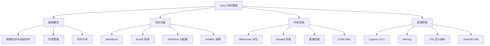

# Linux 内存管理专题

Linux 内存管理是内核中最复杂、最核心的子系统之一。它负责管理系统中的物理内存和虚拟内存，为进程提供内存抽象，实现内存隔离和保护，并在内存紧张时进行回收和优化。

## 📋 内容概览

本专题涵盖 Linux 内存管理的方方面面，从基础概念到源码实现，从理论分析到实战应用。

### 核心模块



## 🎯 学习路线

### 第一阶段：基础概念（必读）

理解内存管理的基本概念是深入学习的前提。

#### 1. 内存与内存管理机制
- 物理内存 vs 虚拟内存
- 为什么需要虚拟内存
- MMU（内存管理单元）的作用
- 页（Page）与页框（Page Frame）

#### 2. 内存分布
- 用户空间与内核空间
- 内存布局（Stack、Heap、BSS、Data、Text）
- ARM64 的内存地址空间
- 直接映射区与 vmalloc 区

#### 3. 页表管理
- 页表的多级结构（PGD、PUD、PMD、PTE）
- 页表遍历过程
- TLB（Translation Lookaside Buffer）
- 大页（Huge Pages）机制

**推荐阅读：**
- [Linux 内存管理（一）：内存与内存管理机制](#)
- [Linux 内存管理（二）：页面查询过程简述](#)
- [Linux 内存管理（三）：内存与内存分布](#)

### 第二阶段：内存分配器

Linux 提供了多层次的内存分配机制，适应不同场景的需求。

#### 1. Memblock 分配器
- 启动早期的内存管理
- Memblock 的发展历程
- 内存区域（Regions）管理
- 从 Memblock 到 Buddy 的过渡

**推荐阅读：**
- [Linux 内存管理（九）：memblock 发展过程概述](#)
- [Linux 内存管理（七）：start_kernel 详解](#)

#### 2. Buddy（伙伴）系统
物理页面分配器，管理所有的空闲物理页面。

**核心概念：**
- 伙伴算法原理（2^n 页面块）
- 迁移类型（MIGRATE_TYPES）
- Per-CPU 页面缓存
- 冷热页机制

**分配流程：**
- 快速路径（Fast Path）
- 慢速路径（Slow Path）
- 后备迁移（Fallback）机制

**推荐阅读：**
- [Linux 内存管理（二十一）：buddy 系统简介和初始化](#)
- [Linux 内存管理（二十二）：buddy 分配器前篇](#)
- [Linux 内存管理（二十三）：buddy 分配器之 __alloc_pages_nodemask](#)
- [Linux 内存管理（二十五）：buddy 分配器之 rmqueue](#)
- [Linux 内存管理（二十七）：buddy 分配器之慢速分配](#)
- [Linux 内存管理（二十八）：buddy 分配器之页面释放](#)

#### 3. Slab/Slub 分配器
小对象缓存分配器，提高小内存分配的效率。

**核心概念：**
- Slab 层的设计思想
- kmem_cache 对象缓存
- CPU 缓存与 NUMA 节点
- 对象复用与初始化

**Slub 实现：**
- Slub 分配器的优化
- Per-CPU Slab
- Partial 链表管理
- 对象分配与释放流程

**推荐阅读：**
- [Linux 内存管理（三十一）：slab 分配器概述](#)
- [Linux 内存管理（三十二）：slub 分配器初始化](#)
- [Linux 内存管理（三十三）：slub 分配器之 __kmem_cache_create](#)
- [Linux 内存管理（三十四）：slub 分配器之 kmem_cache_alloc](#)
- [Linux 内存管理（三十五）：slub 分配器之 kmem_cache_create](#)
- [Linux 内存管理（三十六）：slub 分配器之 kmem_cache_free](#)
- [Linux 内存管理（三十七）：slub 分配器之 kmem_cache_destroy](#)
- [Linux 内存管理（三十八）：slub 分配器之 kmalloc 详解](#)

### 第三阶段：内存回收机制

当系统内存紧张时，内核需要回收部分内存以满足新的分配需求。

#### 1. 内存 Watermark（水位线）
- Low、High、Min 三个水位
- 水位的计算方法
- 水位与内存回收的触发

**推荐阅读：**
- [Linux 内存管理（二十九）：内存 watermark 详解](#)

#### 2. 内存回收策略
- **kswapd 后台回收**：异步回收，不阻塞进程
- **直接回收（Direct Reclaim）**：同步回收，可能导致延迟
- **回收优先级**：扫描力度的控制
- **LRU 链表**：页面活跃度管理

#### 3. 页面回收类型
- 匿名页（Anonymous Pages）回收
- 文件页（File Pages）回收
- Page Cache 回收
- Swap 机制

### 第四阶段：资源控制与隔离

在容器化和虚拟化环境中，资源隔离变得尤为重要。

#### 1. Cgroup（控制组）
- Cgroup v1 架构
- Cgroup v2 统一层级
- 资源限制与统计
- 子系统（Subsystems）

**推荐阅读：**
- [Linux 内存管理（七十四）：cgroup v2 简介](#)
- [Linux 内存管理（七十五）：memcg v2 简介](#)
- [Linux 内存管理（七十六）：memcg v1 简介](#)

#### 2. Memcg（内存控制组）
- 内存限制（Memory Limit）
- 内存统计（Memory Statistics）
- OOM 控制
- 内存回收行为

#### 3. PSI（Pressure Stall Information）
压力失速信息，量化系统资源压力。

**核心指标：**
- Some 压力（部分任务等待）
- Full 压力（所有任务等待）
- 内存、CPU、I/O 三个维度
- 压力阈值告警

**推荐阅读：**
- [Linux PSI 指标](#)
- [Linux 内存管理（七十一）：Linux PSI 详解（1）](#)
- [Linux 内存管理（七十二）：Linux PSI 详解（2）](#)
- [Linux 内存管理（七十三）：Linux PSI 详解（3）](#)

### 第五阶段：高性能与优化

#### 1. 零拷贝技术
- sendfile 系统调用
- splice 管道拼接
- mmap 内存映射
- 减少数据拷贝次数

#### 2. Page Cache 与 Buffer Cache
- Page Cache 的作用
- 预读（Readahead）机制
- 脏页（Dirty Pages）回写
- Buffer Cache 与块设备

#### 3. DMA（直接内存访问）
- DMA 工作原理
- DMA 缓冲区管理
- IOMMU 虚拟化
- Streaming DMA vs Coherent DMA

**推荐阅读：**
- [Linux DMA、Page Cache、Buffer Cache 和零拷贝](#)

### 第六阶段：Android 专题

Android 基于 Linux 内核，但针对移动设备做了很多优化。

#### 1. LMK（Low Memory Killer）
- LMK 的工作原理
- 进程优先级（ADJ）
- 内存阈值配置
- 从内核 LMK 到用户态 lmkd

#### 2. lmkd 机制
- lmkd 守护进程
- 与 ActivityManagerService 的交互
- 基于 PSI 的内存压力检测
- 进程终止策略

**推荐阅读：**
- [Android lmkd 机制详解（一）](#)
- [Android lmkd 机制详解（二）](#)

## 🔧 实践与调试

### 内存调试工具

#### 1. /proc 文件系统
```bash
# 查看系统内存信息
cat /proc/meminfo

# 查看进程内存映射
cat /proc/<pid>/maps
cat /proc/<pid>/smaps

# 查看 Slab 信息
cat /proc/slabinfo

# 查看内存区域
cat /proc/zoneinfo
```

#### 2. 内核调试接口
```bash
# 查看 Buddy 系统信息
cat /proc/buddyinfo
cat /proc/pagetypeinfo

# 触发内存回收（需要 root）
echo 3 > /proc/sys/vm/drop_caches

# 查看 OOM 日志
dmesg | grep -i oom
```

#### 3. 性能分析工具
```bash
# 使用 perf 分析内存性能
perf record -e page-faults -ag
perf report

# 使用 ftrace 追踪内存分配
echo function > /sys/kernel/debug/tracing/current_tracer
echo __alloc_pages_nodemask > /sys/kernel/debug/tracing/set_ftrace_filter
```

### 常见问题排查

#### 内存泄漏
- 使用 kmemleak 检测
- 分析 /proc/slabinfo 的增长
- 追踪 kmalloc/kfree 调用

#### OOM（Out Of Memory）
- 分析 OOM 日志
- 检查进程内存占用
- 调整 OOM 评分（oom_score_adj）

#### 内存碎片
- 检查 /proc/buddyinfo
- 使用内存规整（Memory Compaction）
- 配置 Huge Pages

## 📊 关键数据结构

理解这些核心数据结构对深入学习至关重要：

### struct page
```c
struct page {
    unsigned long flags;        // 页面标志
    atomic_t _refcount;        // 引用计数
    atomic_t _mapcount;        // 映射计数
    struct list_head lru;      // LRU 链表
    // ...
};
```

### struct zone
```c
struct zone {
    unsigned long watermark[NR_WMARK];  // 水位线
    struct free_area free_area[MAX_ORDER];  // 空闲页面
    struct per_cpu_pageset __percpu *pageset;  // Per-CPU 页面集
    // ...
};
```

### struct kmem_cache
```c
struct kmem_cache {
    struct kmem_cache_cpu __percpu *cpu_slab;  // CPU 缓存
    struct kmem_cache_node *node[MAX_NUMNODES];  // NUMA 节点
    unsigned int size;         // 对象大小
    unsigned int object_size;  // 真实对象大小
    // ...
};
```

## 📚 推荐阅读顺序

### 新手入门（1-2个月）
1. ✅ 内存与内存管理机制
2. ✅ 页面查询过程简述
3. ✅ 内存与内存分布
4. ✅ memblock 发展过程概述
5. ✅ buddy 系统简介和初始化
6. ✅ slab 分配器概述

### 进阶学习（2-3个月）
1. ✅ Buddy 系统完整流程（6篇文章）
2. ✅ Slub 分配器完整实现（7篇文章）
3. ✅ 内存 watermark 详解
4. ✅ start_kernel 详解

### 高级主题（2-3个月）
1. ✅ Cgroup v2 简介
2. ✅ Memcg v1/v2 简介
3. ✅ PSI 详解系列（3篇文章）
4. ✅ Android lmkd 机制（2篇文章）
5. ✅ DMA、Page Cache 和零拷贝

## 🎓 学习建议

### 阅读源码
内存管理的核心代码主要在以下目录：
```
mm/                    # 内存管理核心代码
├── page_alloc.c      # Buddy 系统
├── slab.c            # Slab 分配器
├── slub.c            # Slub 分配器
├── memblock.c        # Memblock 分配器
├── vmscan.c          # 内存回收
├── oom_kill.c        # OOM Killer
└── memcontrol.c      # Memory Cgroup

arch/arm64/mm/        # ARM64 架构相关
include/linux/mm*.h   # 头文件定义
```

### 实验环境
```bash
# 编译一个可调试的内核
make menuconfig
# 开启 CONFIG_DEBUG_VM
# 开启 CONFIG_SLUB_DEBUG
# 开启 CONFIG_KMEMLEAK

make -j$(nproc)

# 使用 QEMU 运行
qemu-system-aarch64 -kernel Image -append "nokaslr" -s -S
```

### 学习路径
1. **理论 → 实践 → 源码**：先理解概念，再动手实验，最后看源码验证
2. **由浅入深**：从使用者角度到开发者视角
3. **对比学习**：Slab vs Slub、Cgroup v1 vs v2
4. **画图总结**：流程图、数据结构图帮助理解

## 🔗 相关资源

### 内核文档
- [Memory Management Documentation](https://www.kernel.org/doc/html/latest/admin-guide/mm/)
- [Linux Memory Management](https://www.kernel.org/doc/gorman/)

### 推荐书籍
- 《深入理解 Linux 内核》
- 《深入 Linux 内核架构》
- 《Understanding the Linux Virtual Memory Manager》

### 在线资源
- [LWN.net - Memory Management](https://lwn.net/Kernel/Index/#Memory_management)
- [Kernel Newbies](https://kernelnewbies.org/)

---

开始你的 Linux 内存管理学习之旅吧！🚀

从[基础概念](#第一阶段基础概念必读)开始，逐步深入到复杂的机制和实现细节。记住，内存管理很复杂，需要耐心和持续的学习。
